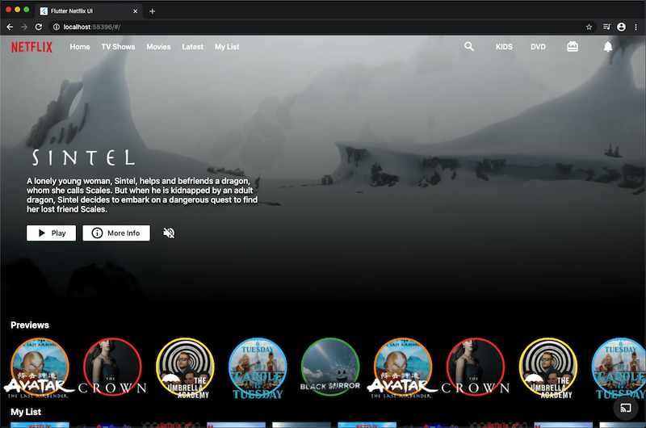

# Flutter Netflix Responsive UI Tutorial | Web and Mobile

A Netflix User Interface Clone project to learn Flutter!

## Information

This is a Netflix UI clone for mobile and web done to practice some Flutter and Dart! To execute this clone, just run it as a you would do with any Flutter Project.

## License

Distributed under the GPL License. See `LICENSE.txt` for more information.

## Contact

Pablo Olivares - [pablolivares1502@gmail.com](mailto:pablolivares1502@gmail.com)

Project Link: https://github.com/pab1s/flutter-netflix-responsive-ui

